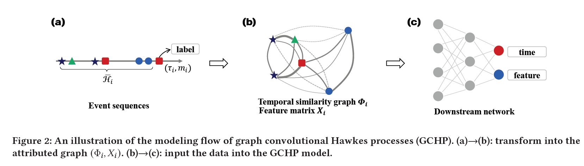

# Graph-Convolutional-Hawkes-Processes-GCHP

This work introduces a Graph Convolutional Hawkes Process (GCHP) method incorperating marked point processes model to deal with predictions on attributed event sequences. 

### Model overview



Firstly, our model transforms the marked event sequences into temporal similarity graph with feature matrix. Then, we feed the data into the GCHP model.

### Preparation

The following python library dependencies need to be installed:

- pandas
- numpy
- torch (with CUDA) >= 1.7 (detailed installation documents can be found in https://pytorch.org/)

### Dataset

- ATM
- Weeplace
- IPTV
- HawkesProcess_synthetic (synthetic dataset)

### Train the model

To quickly run the model on ATM dataset, just run:

```
python train.py --dataset ATM
```

You may run GCHP on other datasets with different hyperparameter settings: epochs, batch_size, memory_size, theta, eta, hidden, etc. Here we show an example of training on IPTV:

```
python train.py --dataset IPTV --batch_size 50000 --memory_size 10 --epochs 200 --theta 1.0 --eta 1.0 --hidden 50 --record True --loss_type likelihood
```


### Reference

```
@incollection{tianbo2021gchp,
 author = {Tianbo Li, Tianze Luo, Yiping Ke, Sinno Jialin Pan},
 booktitle = {Proceedings of the 27th ACM SIGKDD International Conference on Knowledge Discovery \& Data Mining},
 pages = {},
 title = {Mitigating Performance Saturation in Neural Marked PointProcesses: Architectures and Loss Functions},
 year = {2021}
}
```